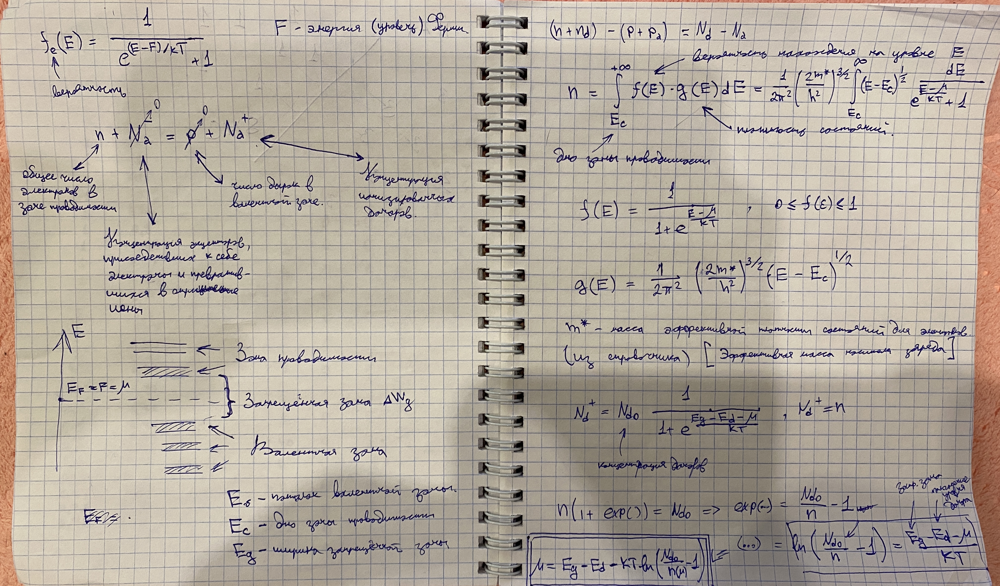
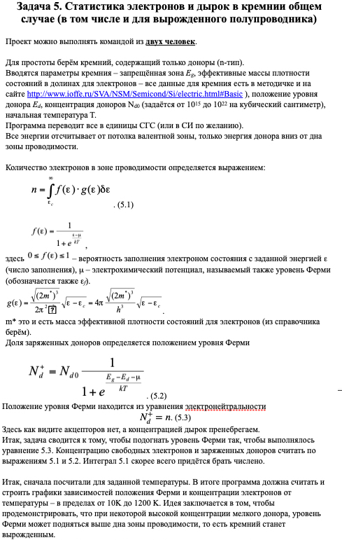

# StatisticsOfElectronicHoles

Полезные ссылки:

Статистика электронов в полупроводниках: https://scask.ru/e_book_tpi.php?id=18

Параметры кремния для ввода в модель: http://www.ioffe.ru/SVA/NSM/Semicond/Si/electric.html#Basic

TODO: solve main equation: F = E_g - E_d - k*T * ln(N_d0/n(F) - 1) (Vectozavr)

TODO: Программа переводит все в единицы СГС (или в СИ по желанию) (Vectozavr)

TODO: GUI (Geridok)

Теоретические наработки:

Задача:

